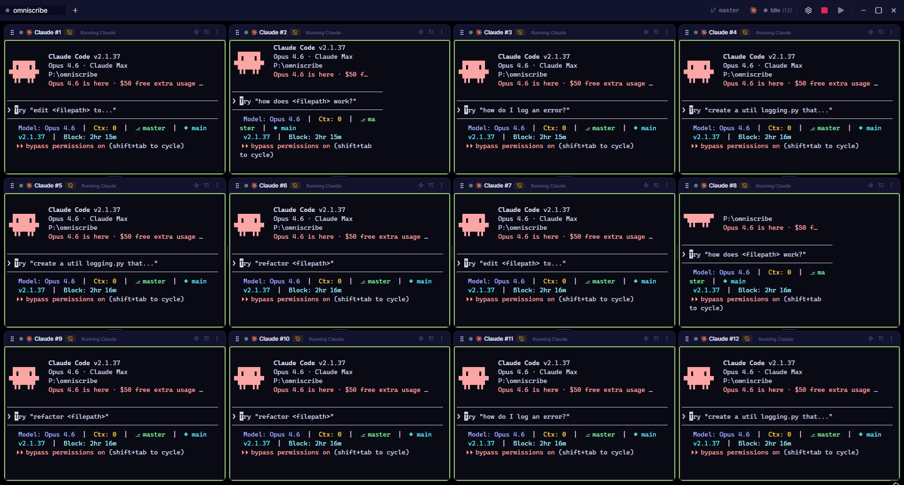
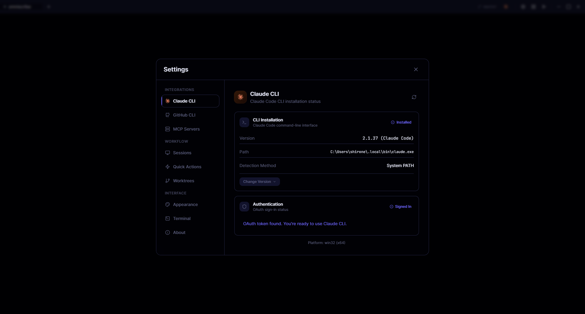

<a name="top"></a>

<div align="center">
  
  <h1>Omniscribe</h1>
  <p><strong>Orchestrate multiple AI coding sessions in parallel</strong></p>

[](https://github.com/Shironex/omniscribe/releases/latest)
[](https://github.com/Shironex/omniscribe/releases/latest)
[](https://www.electronjs.org/)
[](https://react.dev/)
[](https://nestjs.com/)
[](https://www.typescriptlang.org/)
[](https://github.com/Shironex/omniscribe)
[](LICENSE)

**[Download Latest Release](https://github.com/Shironex/omniscribe/releases/latest)** | [macOS](https://github.com/Shironex/omniscribe/releases/latest) | [Windows](https://github.com/Shironex/omniscribe/releases/latest) | [Linux](https://github.com/Shironex/omniscribe/releases/latest)

**[Beta Releases](https://github.com/Shironex/omniscribe/releases)** — opt into pre-release builds via Settings > General > Updates

</div>

## Table of Contents

- [About](#about)
- [Screenshots](#screenshots)
- [Features](#features)
- [Keyboard Shortcuts](#keyboard-shortcuts)
- [Quick Start](#quick-start)
- [Architecture](#architecture)
- [Tech Stack](#tech-stack)
- [Beta Releases](#beta-releases)
- [Contributing](#contributing)
- [License](#license)

## About

Omniscribe is a desktop application for managing multiple AI coding assistant sessions (Claude Code, etc.) simultaneously. Run up to 12 sessions in parallel, each with its own GPU-accelerated terminal, optional git worktree isolation, and MCP server configuration.

## Screenshots

### Multi-Session Grid with Quick Actions


### Main View



### Settings



## Features

| Feature                | Description                                                              |
| ---------------------- | ------------------------------------------------------------------------ |
| **Multi-Session Grid** | Run up to 12 AI sessions in parallel with GPU-accelerated terminal views |
| **Real-Time Status**   | Track session states: idle, working, planning, needs_input, finished     |
| **Drag & Drop**        | Rearrange terminals by dragging; resizable panels with drag dividers     |
| **Terminal Search**    | Ctrl+Shift+F search bar with regex and case-sensitive modes              |
| **11 Terminal Themes** | tokyonight, dracula, nord, monokai, gruvbox, catppuccin, and more        |
| **Terminal Settings**  | Font family/size, cursor style, scrollback, theme — all applied live     |
| **Smart Copy/Paste**   | Ctrl+C copies selection or sends ^C; Ctrl+V pastes from clipboard        |
| **File Path Links**    | Clickable file paths in terminal output open directly in VS Code         |
| **Spatial Navigation** | Ctrl+Alt+Arrow keys to move focus between terminal panes                 |
| **Git Worktrees**      | Isolate each session in its own git worktree for parallel development    |
| **MCP Integration**    | Configure Model Context Protocol servers per session                     |
| **Project Tabs**       | Manage multiple projects with persistent recent history                  |
| **Cross-Platform**     | Native support for Windows, macOS, and Linux                             |

## Keyboard Shortcuts

| Shortcut             | Action                           |
| -------------------- | -------------------------------- |
| `N`                  | Add new session slot             |
| `L`                  | Launch all pending sessions      |
| `1-9`, `0`, `-`, `=` | Launch individual session (1-12) |
| `Ctrl/Cmd + K`       | Stop all running sessions        |
| `Ctrl + Shift + F`   | Open terminal search bar         |
| `Ctrl + Alt + Arrow` | Navigate between terminal panes  |

## Quick Start

```bash
# Clone the repository
git clone https://github.com/Shironex/omniscribe.git
cd omniscribe

# Install dependencies
pnpm install

# Start development
pnpm dev

# Build for production
pnpm build

# Package for distribution
pnpm package          # Current platform
pnpm package:win      # Windows
pnpm package:mac      # macOS
pnpm package:linux    # Linux
```

## Architecture

```
omniscribe/
├── apps/
│   ├── desktop/       # Electron + NestJS backend
│   ├── web/           # React frontend
│   └── mcp-server/    # MCP status server
└── packages/
    └── shared/        # Shared types
```

**Communication Flow:**

```
┌─────────────────────────────────┐
│     Electron Main Process       │
│  ┌───────────────────────────┐  │
│  │    NestJS Backend         │  │
│  │  Terminal │ Session │ Git │  │
│  │    MCP    │ Workspace     │  │
│  └───────────────────────────┘  │
│              │ WebSocket        │
└──────────────┼──────────────────┘
               │
┌──────────────┼──────────────────┐
│     Electron Renderer           │
│  ┌───────────────────────────┐  │
│  │    React + Zustand        │  │
│  │   Terminal Grid │ Stores  │  │
│  └───────────────────────────┘  │
└─────────────────────────────────┘
```

## Tech Stack

| Layer    | Technology                 |
| -------- | -------------------------- |
| Desktop  | Electron 40                |
| Backend  | NestJS 10                  |
| Frontend | React 18, Zustand 5        |
| Terminal | xterm.js (WebGL), node-pty |
| Styling  | Tailwind CSS               |
| Build    | Vite, esbuild              |
| IPC      | Socket.io, Electron IPC    |

## Beta Releases

Omniscribe supports a beta update channel for testing new features before stable release.

**To opt in:**

1. Open **Settings > General > Updates**
2. Click the **Beta** button to switch channels
3. The app will automatically check for and offer beta updates

**To opt out:** Switch back to **Stable** in the same settings panel. If a stable version is older than your current beta, a downgrade will be offered.

Beta releases are tagged with a `-beta` suffix (e.g. `v0.5.0-beta.1`) and marked as pre-release on the [Releases page](https://github.com/Shironex/omniscribe/releases).

## Contributing

Contributions are welcome! Feel free to:

- [Submit an issue](https://github.com/Shironex/omniscribe/issues) for bugs or feature requests
- Open a pull request with improvements
- Share feedback and suggestions

## License

This project is licensed under a custom license — free to use, but you may not resell or redistribute it. See the [LICENSE](LICENSE) file for details.

---

[Back to top](#top)
