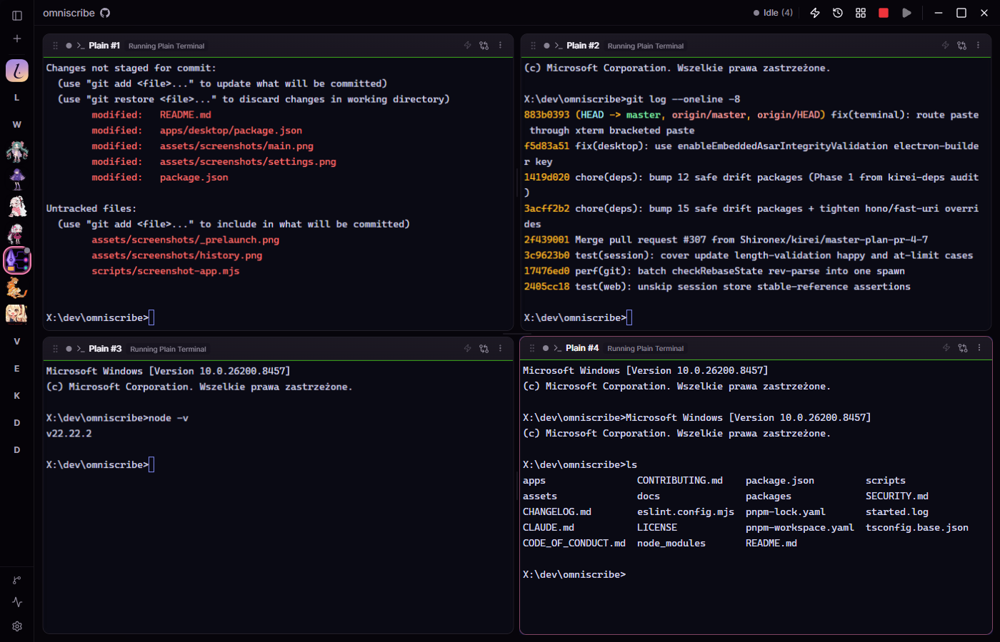
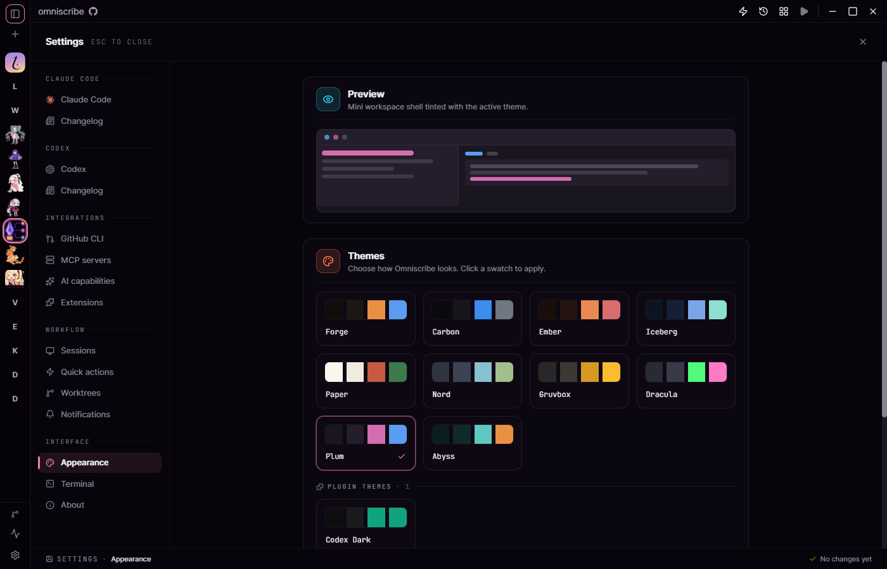
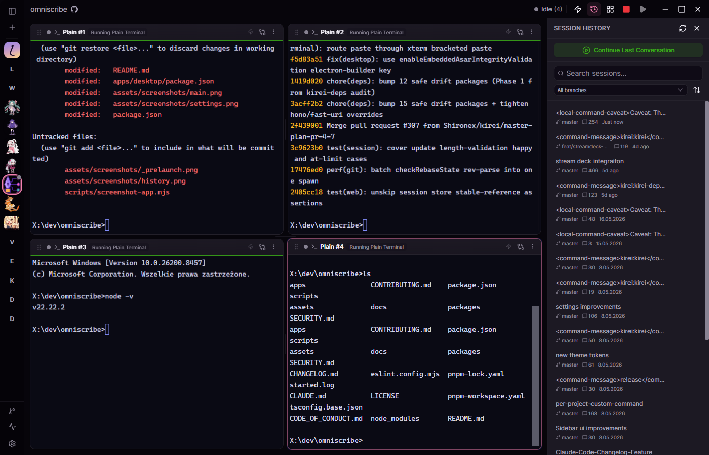
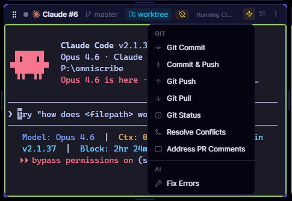

<a name="top"></a>

<div align="center">
  
  <h1>Omniscribe</h1>
  <p><strong>Orchestrate multiple AI coding sessions in parallel</strong></p>

[](https://github.com/Shironex/omniscribe/releases/latest)
[](https://github.com/Shironex/omniscribe/releases/latest)
[](https://www.electronjs.org/)
[](https://react.dev/)
[](https://nestjs.com/)
[](https://www.typescriptlang.org/)
[](https://github.com/Shironex/omniscribe)
[](LICENSE)

**[Download Latest Release](https://github.com/Shironex/omniscribe/releases/latest)** | [macOS](https://github.com/Shironex/omniscribe/releases/latest) | [Windows](https://github.com/Shironex/omniscribe/releases/latest)

**[Beta Releases](https://github.com/Shironex/omniscribe/releases)** — opt into pre-release builds via Settings > About > Updates

</div>

## Table of Contents

- [About](#about)
- [Screenshots](#screenshots)
- [Features](#features)
- [Keyboard Shortcuts](#keyboard-shortcuts)
- [Requirements](#requirements)
- [Quick Start](#quick-start)
- [Development](#development)
- [Architecture](#architecture)
- [Tech Stack](#tech-stack)
- [Beta Releases](#beta-releases)
- [Roadmap](#roadmap)
- [Contributing](#contributing)
- [License](#license)

## About

Omniscribe is a desktop application for managing multiple AI coding assistant sessions simultaneously. With a plugin-based architecture supporting Claude Code and OpenAI Codex CLI, you can run up to 12 sessions in parallel, each with its own GPU-accelerated terminal, optional git worktree isolation, and MCP server configuration.

## Screenshots

<table>
  <tr>
    <td colspan="2" align="center"></td>
  </tr>
  <tr>
    <td colspan="2" align="center"><sub>Workspace — run up to 12 AI sessions in parallel, each in its own GPU-accelerated terminal.</sub></td>
  </tr>
  <tr>
    <td width="50%"></td>
    <td width="50%"></td>
  </tr>
  <tr>
    <td align="center"><sub>Settings — 10 UI themes, terminal tuning, and per-project AI capabilities.</sub></td>
    <td align="center"><sub>Session History — search, filter by branch, and resume or fork past sessions.</sub></td>
  </tr>
  <tr>
    <td colspan="2" align="center"></td>
  </tr>
  <tr>
    <td colspan="2" align="center"><sub>Quick Actions — one-click git workflows (commit, push, resolve conflicts) and AI shortcuts.</sub></td>
  </tr>
</table>

## Features

| Feature                | Description                                                                                                                        |
| ---------------------- | ---------------------------------------------------------------------------------------------------------------------------------- |
| **Multi-Session Grid** | Run up to 12 AI sessions in parallel with GPU-accelerated terminal views                                                           |
| **Real-Time Status**   | Track session states: idle, working, planning, needs_input, finished                                                               |
| **Session History**    | Browse, search, and filter past Claude Code sessions with branch filtering and sort controls                                       |
| **Resume & Fork**      | Resume any previous session or fork it into a new conversation branch                                                              |
| **Continue Last**      | One-click button to continue the most recent Claude Code conversation                                                              |
| **Drag & Drop**        | Rearrange terminals by dragging; resizable panels with drag dividers                                                               |
| **Terminal Search**    | Ctrl+Shift+F search bar with regex and case-sensitive modes                                                                        |
| **12 Terminal Themes** | dracula, nord, gruvbox, and more                                                                                                   |
| **10 UI Themes**       | Forge (default, dark), Carbon, Ember, Iceberg, Nord, Gruvbox, Dracula, Plum, Abyss, Paper (light) — plus plugin-contributed themes |
| **Terminal Settings**  | Font family/size, cursor style, scrollback, theme — all applied live                                                               |
| **Smart Copy/Paste**   | Ctrl+C copies selection or sends ^C; Ctrl+V pastes from clipboard                                                                  |
| **Quick Actions**      | AI-powered shortcuts for git workflows (commit, push, pull, resolve conflicts) and development tasks                               |
| **Git Worktrees**      | Isolate each session in its own git worktree for parallel development                                                              |
| **MCP Integration**    | Configure Model Context Protocol servers per session                                                                               |
| **Hooks Integration**  | Automatic Claude Code hooks for instant session detection via SessionStart/SessionEnd events                                       |
| **Project Tabs**       | Manage multiple projects with persistent recent history                                                                            |
| **Cross-Platform**     | Native support for Windows and macOS                                                                                               |

## Keyboard Shortcuts

| Shortcut               | Action                           |
| ---------------------- | -------------------------------- |
| `N`                    | Add new session slot             |
| `Shift + N`            | Open launch presets modal        |
| `L`                    | Launch all pending sessions      |
| `1-9`, `0`, `-`, `=`   | Launch individual session (1-12) |
| `Ctrl/Cmd + K`         | Stop all running sessions        |
| `Ctrl/Cmd + ,`         | Toggle settings                  |
| `Ctrl/Cmd + Shift + H` | Toggle session history panel     |
| `Ctrl/Cmd + W`         | Close current project tab        |
| `Ctrl/Cmd + 1-9`       | Switch project tab by index      |
| `Ctrl/Cmd + L`         | Clear focused terminal           |
| `Ctrl/Cmd + F`         | Toggle terminal search bar       |

## Requirements

- **Node.js** >= 22.0.0
- **pnpm** >= 9.0.0

## Quick Start

```bash
# Clone the repository
git clone https://github.com/Shironex/omniscribe.git
cd omniscribe

# Install dependencies
pnpm install

# Start development
pnpm dev

# Build for production
pnpm build

# Package for distribution
pnpm package          # Current platform
pnpm package:win      # Windows
pnpm package:mac      # macOS
```

## Development

```bash
# Run tests
pnpm test

# Run tests with coverage
pnpm test:cov

# Type checking
pnpm typecheck

# Lint code
pnpm lint

# Format code
pnpm format

# Check formatting
pnpm format:check
```

### Capturing README screenshots

The README screenshots are captured from the live app over the Chrome DevTools Protocol:

```bash
# Terminal 1 — launch the app with CDP exposed on 127.0.0.1:9222
pnpm dev:inspect

# Terminal 2 — attach via Playwright and write assets/screenshots/<view>.png
pnpm screenshots
```

`dev:inspect` mirrors `pnpm dev` but adds `--remote-debugging-port=9222 --remote-allow-origins=*` so a Playwright client can attach. The capture script forces a deterministic 1400×900 viewport, so docked DevTools never affects the output. Open a project and launch a few sessions before running it to capture the multi-session grid.

## Architecture

```
omniscribe/
├── apps/
│   ├── desktop/       # Electron + NestJS backend
│   ├── web/           # React frontend
│   └── mcp-server/    # MCP status server
└── packages/
    ├── plugin-api/    # Plugin API contracts and base classes
    ├── plugins/
    │   ├── provider-claude/  # Claude Code provider plugin
    │   └── provider-codex/   # OpenAI Codex CLI provider plugin
    └── shared/        # Shared types and utilities
```

**Communication Flow:**

```
┌─────────────────────────────────┐
│     Electron Main Process       │
│  ┌───────────────────────────┐  │
│  │    NestJS Backend         │  │
│  │  Terminal │ Session │ Git │  │
│  │    MCP    │ Workspace     │  │
│  └───────────────────────────┘  │
│              │ WebSocket        │
└──────────────┼──────────────────┘
               │
┌──────────────┼──────────────────┐
│     Electron Renderer           │
│  ┌───────────────────────────┐  │
│  │    React + Zustand        │  │
│  │   Terminal Grid │ Stores  │  │
│  └───────────────────────────┘  │
└─────────────────────────────────┘
```

## Tech Stack

| Layer    | Technology                 |
| -------- | -------------------------- |
| Desktop  | Electron 41                |
| Backend  | NestJS 10                  |
| Frontend | React 18, Zustand 5        |
| Terminal | xterm.js (WebGL), node-pty |
| Styling  | Tailwind CSS               |
| Build    | Vite, esbuild              |
| IPC      | Socket.io, Electron IPC    |

## Beta Releases

Omniscribe supports a beta update channel for testing new features before stable release.

**To opt in:**

1. Open **Settings > About > Updates**
2. Click the **Beta** button to switch channels
3. The app will automatically check for and offer beta updates

**To opt out:** Switch back to **Stable** in the same settings panel. If a stable version is older than your current beta, a downgrade will be offered.

Beta releases are tagged with a `-beta` suffix (e.g. `v0.5.0-beta.1`) and marked as pre-release on the [Releases page](https://github.com/Shironex/omniscribe/releases).

## Roadmap

Track active work on the [public project board](https://github.com/users/Shironex/projects/7).

Omniscribe is a **universal AI coding orchestrator** built on a plugin architecture. The plugin system and multi-provider support have shipped — both **Claude Code** and **OpenAI Codex CLI** are available as first-class provider plugins, complete with slot-based UI injection, dynamic per-provider settings, and an in-app marketplace.

The one known gap: MCP server configuration for the Codex provider. Codex reads MCP servers from a TOML-based `~/.codex/config.toml` rather than `.mcp.json`, and that bridge isn't wired up yet. Everything else — session management, usage tracking, hooks — works across both providers.

**Want to add a provider?** See the [Creating a Provider](https://shironex.github.io/omniscribe/sdk/creating-a-provider) guide and the [API Reference](https://shironex.github.io/omniscribe/docs/api).

## Contributing

Contributions are welcome! Feel free to:

- [Submit an issue](https://github.com/Shironex/omniscribe/issues) for bugs or feature requests
- Open a pull request with improvements
- Read the [Creating a Provider](https://shironex.github.io/omniscribe/sdk/creating-a-provider) guide to contribute a provider plugin
- Share feedback and suggestions

## License

This project is licensed under the [MIT License](LICENSE).

---

[Back to top](#top)
